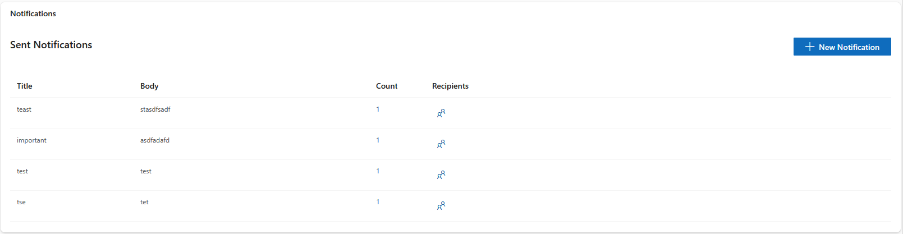
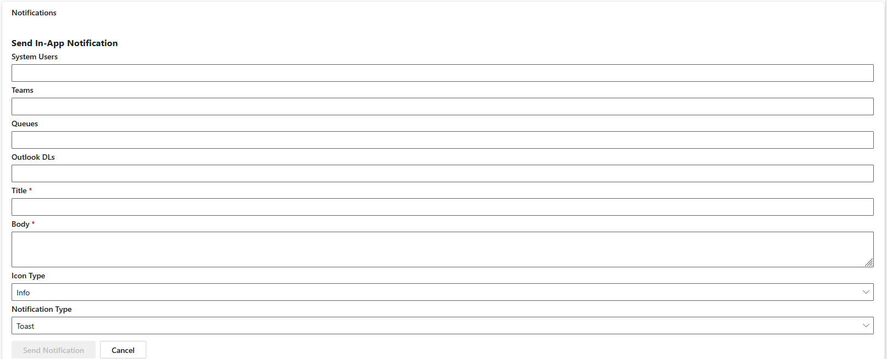
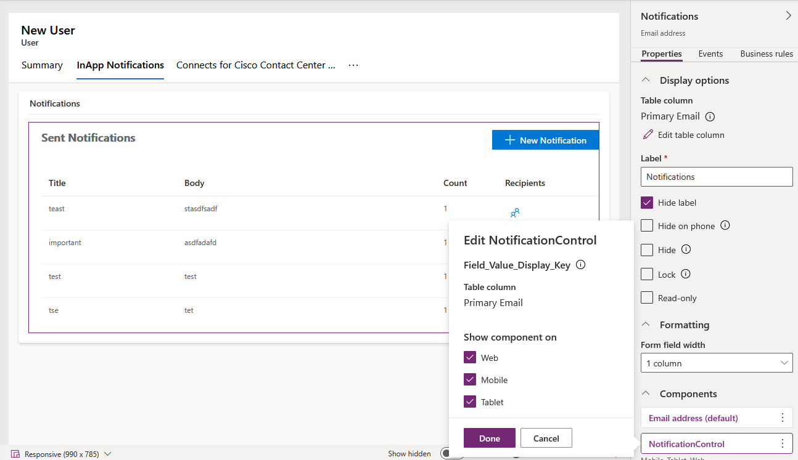

# In-App Notification PCF Control

> **⚠️ DISCLAIMER**
> 
> This control is provided as-is for community use. It has been tested for minimum positive flow scenarios only. **The author and Microsoft provide no warranties, express or implied, regarding the reliability, security, or suitability of this control for your specific use case.**
>
> **Before deploying this control in your organization:**
> - Conduct a thorough review of the control's code and functionality
> - Ensure compliance with your organization's security policies
> - Validate alignment with your organization's design and governance standards
> - Test extensively in a non-production environment
> - Perform security and vulnerability assessments as required by your organization
> 
## Overview
A robust Power Apps Component Framework (PCF) control for Dataverse, designed to deliver, display, and manage in-app notifications. This control supports secure environment variable lookup, publisher-agnostic logic, recipient resolution, and integrates with Microsoft Graph for advanced scenarios. It is built for easy adoption by developers and customers.

**Testing Status:** This control has been tested for minimum positive flow scenarios. Comprehensive testing for edge cases, error handling, and production readiness is recommended before deployment.

For more information about in-app notifications in Dataverse, see [Microsoft Docs: Send in-app notifications within model-driven apps](https://learn.microsoft.com/power-apps/developer/model-driven-apps/clientapi/send-in-app-notifications).

## Build & Run

```bash
npm install
npm run build
```

## Features
- **Notification Delivery:** Send notifications to users or groups in Dataverse.
- **Recipient Resolution:** Fetch and display recipient names using systemuser IDs.
- **Environment Variable Lookup:** Secure, publisher-agnostic configuration.
- **Microsoft Graph Integration:** Authenticate and fetch data from Microsoft Graph using MSAL.js.
- **Robust UI:** Modern, responsive React components with Fluent UI styling.
- **Error Handling:** Graceful fallback for missing recipients and robust client-side logic.

## Project Structure
```
NotificationControl/
  components/
    NotificationDetails.tsx      # Displays notification details and recipient info
    NotificationForm.tsx         # Main form for creating and sending notifications
    NotificationList.tsx         # Lists all notifications and handles navigation
    NotificationForm.css         # Styles for the notification form
    NotificationList.css         # Styles for the notification list
  context/
    NotificationContext.tsx      # React context for notification state
  hooks/
    useNotifications.ts          # Custom hook for notification logic
  utils/
    api.ts                       # Core notification logic, environment variable lookup, Graph API integration
    auth.ts                      # Authentication helpers for MSAL.js
  ControlManifest.Input.xml      # PCF control manifest (input)
  ControlManifest.xml            # PCF control manifest
  index.ts                       # Entry point for the control
```

## Component Details & Usage

### NotificationList.tsx
- **Purpose:** Displays a list of notifications and allows navigation to detail view. Notifications are grouped by title and body for efficiency.
- **Props:**
  - `notifications`: Array of notification objects.
  - `onSelect`: Handler to select a notification for detail view.
- **Key Features:**
  - **Grouping:** Notifications are grouped by title and body because the same notification is sent separately to each recipient in Dataverse. This prevents duplicate entries in the list view.
  - **Lazy Loading:** Recipients are loaded on-demand (lazy loaded) when you click to view details, reducing initial load time and improving performance.
  - **Date Filtering:** Only notifications from the last 7-14 days are loaded to keep the list manageable and avoid costly aggregation queries on large datasets.
- **Adoption:**
  - Use to provide users with an overview of all notifications. Passes context and props to child components.


*Sent notifications grouped by title and body, showing count and recipient access.*

### NotificationDetails.tsx
- **Purpose:** Displays the details of a notification, including title, body, icon, type, and recipient information.
- **Props:**
  - `notification`: The notification object to display.
  - `showSystemUsers`: Whether to show recipient info.
  - `onBack`: Handler to return to the notification list.
  - `context`: Dataverse context for API calls.
- **Key Functions:**
  - `fetchNames`: Fetches recipient names from Dataverse using systemuser IDs. Handles missing recipients gracefully by showing "No recipient assigned".
- **Adoption:**
  - Use in detail view to show notification info and recipient names. Handles all edge cases for missing or undefined recipients.


*Detail view with graceful fallback for missing recipients.*

### NotificationForm.tsx
- **Purpose:** Main form for creating and sending notifications. Centralizes environment variable and authentication logic.
- **Props:**
  - `context`: Dataverse context for environment variable lookup and authentication.
- **Key Functions:**
  - Handles user input, MSAL authentication, and notification submission.
- **Features:**
  - Multiple recipient selection options: System Users, Teams, Queues, and Outlook DLs
  - Required fields: Title and Body
  - Optional settings: Icon Type (Info, Success, Error, Warning) and Notification Type (Toast, Banner)
- **Adoption:**
  - Use as the entry point for users to create and send notifications. Integrates with Microsoft Graph for advanced scenarios.
  

*Comprehensive form with multiple recipient selection options: System Users, Teams, Queues, and Outlook DLs.*

### NotificationContext.tsx
- **Purpose:** Provides global notification state and actions to components via React context.
- **Adoption:**
  - Use to share notification state and actions across components.

### useNotifications.ts
- **Purpose:** Custom React hook for fetching, sending, and managing notifications.
- **Adoption:**
  - Use in components to access notification logic and state.

### api.ts
- **Purpose:** Contains core logic for notification delivery, environment variable lookup, recipient resolution, and Microsoft Graph API integration.
- **Key Functions:**
  - `getDLMemberObjectIds`, `getSystemUserIdsByObjectIds`, `getSystemUserNamesByIds`: Utility functions for recipient resolution.
- **Adoption:**
  - Use for all backend logic and API calls related to notifications.

### auth.ts
- **Purpose:** Handles authentication logic using MSAL.js for Microsoft Graph API access.
- **Adoption:**
  - Use to authenticate users and obtain tokens for Graph API calls.

## How to Adopt This Control
1. **Import the control into your Dataverse environment.**
2. **Configure environment variables for publisher-agnostic setup.**
3. **Grant users read privileges on the `appnotifications` entity.** Users receiving in-app notifications must have read privilege on the `appnotifications` table in Dataverse to view their notifications.
4. **Use NotificationForm to create and send notifications.**
5. **Display notifications using NotificationList and NotificationDetails.**
6. **Integrate with Microsoft Graph by configuring Azure AD app registration and MSAL.js.**
7. **Customize styles using the provided CSS files.**

## Prerequisites: Environment Variables & Attaching the Control

### 1. Environment Variables Setup

**Important:** This control uses **Dataverse environment variables** (not local `.env` files) to store configuration values like Azure AD app registration details for Microsoft Graph integration.

**Required Environment Variables:**
You must create the following environment variables in your Dataverse organization:

1. **`InAppNotif_App_Tenant_Id`** - Your Azure AD Tenant ID
2. **`InAppNotif_App_Client_Id`** - Your Azure AD App Registration Client ID (for Microsoft Graph/MSAL authentication)

**How to Create Environment Variables in Dataverse:**

1. Go to **Power Apps Maker Portal** (make.powerapps.com)
2. Select **Solutions** from the left navigation
3. Open your solution (or create a new one)
4. Click **New** > **More** > **Environment variable**
5. Create each variable:
   - **Display Name**: `InAppNotif App Tenant Id` (or similar)
   - **Name**: `InAppNotif_App_Tenant_Id`
   - **Data Type**: Text
   - **Default Value**: Your Azure AD Tenant ID
   - Repeat for `InAppNotif_App_Client_Id`

**How the Control Uses These Variables:**

The control reads these environment variables at runtime using the Dataverse WebAPI:

```typescript
// Example from api.ts
const clientId = await getEnvironmentVariable("InAppNotif_App_Client_Id", context);
const tenantId = await getEnvironmentVariable("InAppNotif_App_Tenant_Id", context);
```

This approach makes the control **publisher-agnostic** and **easy to configure** across different environments without modifying code.

### 2. Attaching the Control to a Form
This PCF control can be attached to **any field on any form** in Dataverse. The control supports the following field types:
- Single Line of Text
- Email
- Phone
- URL
- Multiple Lines of Text
- Whole Number

**Important:** The field value itself is not used by the control—it only serves as a placeholder for the control's UI. You can place this control on any entity (User, Account, Contact, custom entities, etc.) based on your requirements.

**Steps:**

1. **Navigate to the Form Editor**
   - Go to **Power Apps Maker Portal** (make.powerapps.com)
   - Select **Tables** from the left navigation
   - Choose your desired table (e.g., **User**, **Account**, **Contact**)
   - Click on **Forms** tab
   - Select and edit the form where you want to add notifications

2. **Add or Select a Field**
   - Find an existing field that matches one of the supported types (Text, Email, Phone, URL, Multiple Lines, Whole Number)
   - Or add a new field to the form if needed
   - Click on the field to select it

3. **Add the Custom Control**
   - With the field selected, click **+ Component** in the right panel
   - Or right-click the field and select **Properties** > **Components** tab
   - Click **+ Component**
   - Search for and select **NotificationControl**
   - The control will appear in the Components list

4. **Configure Control Properties**
   - **Label**: Set a custom label (e.g., "Notifications")
   - **Hide label**: Check this to hide the field label (recommended for cleaner UI)
   - **Form field width**: Set to desired column width (default: 1 column)
   - **Show component on**: Select platforms (Web, Mobile, Tablet)
   - Click **Done**

5. **Set as Primary Control (Optional)**
   - In the Components section, you'll see both the default field control and NotificationControl
   - You can make NotificationControl the primary control for better visibility
   - Or keep both and configure display preferences

6. **Save and Publish**
   - Click **Save** to save your changes
   - Click **Publish** to make the control available to users
   - The control will now appear on the form when users access it


*Example: NotificationControl configured on Primary Email field of User form*

**Result:**
- The control will appear on the form, showing all in-app notifications for the current environment
- Users can view, create, and manage notifications directly from any form where the control is placed
- The control displays with a "New Notification" button and list of existing notifications grouped by title/body

## Prerequisites: Outlook DL Selection & Graph API Access

### 1. Outlook Distribution List (DL) Selection
To enable users to select Outlook Distribution Lists (DLs) for notifications, your control integrates with Microsoft Graph API. This requires:
- Azure AD app registration with delegated permissions to read DLs and users.
- Environment variable(s) to store the Azure AD Client ID and other config.

**Steps:**
- Register an app in Azure AD (portal.azure.com > Azure Active Directory > App registrations).
- Add delegated permissions for `Group.Read.All`, `User.Read`, and any other required Graph scopes.
- Store the Client ID and other config in Dataverse environment variables.
- Configure your control to use these variables for Graph API calls.

### 2. App Registration & Graph API Access
- The app registration must allow access to Microsoft Graph for reading users and groups.
- Redirect URI should be set for SPA (Single Page Application) and implicit grant enabled.
- The control uses MSAL.js to authenticate and acquire tokens for Graph API.

**Security Note:**
- By default, the control stores the authentication token in the browser (local/session storage) for convenience and seamless user experience.
- **If customers want to avoid storing tokens in the browser:**
  - They can disable persistent authentication or use a different MSAL configuration.
  - This may require users to re-authenticate more frequently and could impact usability.
  - Document this option in your deployment guide and provide configuration instructions.

**Example MSAL config:**
```typescript
const msalConfig = {
  auth: {
    clientId: clientIdFromEnvVar,
    authority: "https://login.microsoftonline.com/common",
    redirectUri: window.location.origin
  },
  cache: {
    cacheLocation: "sessionStorage", // or "localStorage"
    storeAuthStateInCookie: false
  }
};
```

## Redirect URI Requirement for MSAL Silent Authentication

### Why You Need a Redirect URI
For MSAL.js to perform silent authentication (acquire tokens without user interaction), your Azure AD app registration must include a valid redirect URI. In Dataverse/Power Apps, this is often set to an empty HTML web resource.

**Purpose:**
- The redirect URI is where MSAL will redirect the browser after authentication.
- For silent authentication, MSAL uses an iframe and the redirect URI must be a valid, accessible page in your environment.
- An empty HTML web resource is commonly used because it loads quickly and does not display content.

### How to Set Up
1. **Create an empty HTML web resource in Dataverse:**
   - Go to Power Apps > Solutions > Add > Web Resource.
   - Name it (e.g., `msal-redirect.html`).
   - Content can be just:
     ```html
     <html><head></head><body></body></html>
     ```
   - Save and publish.
2. **Add the web resource URL as a redirect URI in Azure AD app registration:**
   - Go to Azure Portal > Azure Active Directory > App registrations > Your app.
   - Under **Authentication**, add the web resource URL (e.g., `https://<org>.crm.dynamics.com/WebResources/msal-redirect.html`) as a redirect URI for SPA.
   - Enable **Access tokens** and **ID tokens** under Implicit grant.

**Important:**
When adding your web resource redirect URI as a SPA in Azure AD app registration, ensure you enable both **Access token** and **ID token** under Implicit grant. This allows MSAL.js to acquire tokens for authentication and API access, enabling seamless user experience and secure integration with Microsoft Graph.

### Example
```plaintext
Redirect URI: https://yourorg.crm.dynamics.com/WebResources/msal-redirect.html
```

### Why This Matters
- Without a valid redirect URI, MSAL cannot complete silent authentication and users may be prompted to sign in more often.
- The empty HTML web resource acts as a safe landing page for token acquisition.

## Using Dataverse Teams for In-App Notifications

If your organization configures on-floor teams as Dataverse Teams (with members assigned in Dataverse), supervisors can leverage this feature to send targeted in-app notifications to their team members.

### How It Works
- **Dataverse Team:** A group entity in Dataverse that can have multiple users as members. Teams can represent departments, on-floor groups, or any logical unit.
- **Supervisor Use Case:** If you are a supervisor and your team is set up as a Dataverse Team, you can select the team in the notification form and send in-app notifications to all its members at once.

### Benefits
- **Targeted Communication:** Easily notify all team members about important updates, tasks, or alerts.
- **Efficient Workflow:** No need to select individual users; simply select the team and send the notification.
- **Integration:** The PCF control fetches team members from Dataverse and ensures notifications are delivered to each member.

### Example Scenario
> A supervisor wants to notify their on-floor team about a shift change. The team is configured as a Dataverse Team. The supervisor selects the team in the notification form and sends the message. All team members receive the notification instantly in their Dataverse environment.

### How to Set Up
1. Ensure your teams are created and configured in Dataverse (Power Apps > Teams).
2. Assign users as members to each team.
3. Use the notification form in the PCF control to select a team and send notifications.

---

This approach streamlines communication and ensures all relevant users are informed efficiently. For more details, see [Microsoft Docs: Manage teams in Dataverse](https://learn.microsoft.com/power-platform/admin/manage-teams).

## Using Queue Selection for Workstream Notifications

If your organization uses queues and workstreams (common in Customer Service or Omnichannel scenarios), you can leverage queue selection to send in-app notifications to all agents associated with a specific workstream.

### How It Works
- **Queue:** A Dataverse entity that holds work items and is associated with agents who can work on those items.
- **Workstream:** A collection of queues and routing rules that define how work is distributed to agents.
- **Agent Use Case:** Supervisors or admins can select a queue in the notification form to send in-app notifications to all agents assigned to that queue's workstream.

### Benefits
- **Targeted Communication:** Notify all agents working on a specific queue or workstream about important updates, new assignments, or urgent issues.
- **Efficient Workflow:** No need to manually identify and select agents; simply select the queue and the control will resolve all associated agents.
- **Integration:** The PCF control fetches queue members from Dataverse and ensures notifications are delivered to each agent.

### Example Scenario
> A supervisor wants to notify all agents working on the "Support Queue" about a critical system update. The supervisor selects the queue in the notification form and sends the message. All agents associated with that queue's workstream receive the notification instantly.

### How to Set Up
1. Ensure your queues and workstreams are configured in Dataverse (Power Apps > Queues).
2. Assign agents to queues or workstreams.
3. Use the notification form in the PCF control to select a queue and send notifications to all associated agents.

---

This approach is especially useful for Customer Service and Omnichannel environments where agents are organized by workstreams. For more details, see [Microsoft Docs: Manage queues in Dataverse](https://learn.microsoft.com/dynamics365/customer-service/set-up-queues-manage-activities-cases).

---

For more details, see the [Microsoft Docs: Use environment variables in Dataverse](https://learn.microsoft.com/power-apps/maker/data-platform/environment-variables), [Add PCF controls to forms](https://learn.microsoft.com/power-apps/developer/component-framework/add-custom-controls-forms-views), [Microsoft Docs: Register an app with Azure AD](https://learn.microsoft.com/azure/active-directory/develop/quickstart-register-app), and [MSAL.js configuration options](https://learn.microsoft.com/azure/active-directory/develop/msal-js-initializing-client-applications).

## Developer Notes
- All components are documented with JSDoc comments for easy understanding.
- Error handling and fallback logic are implemented for robust user experience.
- The codebase is modular and easy to extend for new notification types or integrations.

## Contributing
- Fork the repository and create a pull request for improvements or bug fixes.
- Please document new components and functions using JSDoc comments and update the README as needed.

## Testing & Production Readiness

**Current Testing Status:** This control has been tested for minimum positive flow scenarios only.

**Before Production Deployment:**
- Perform comprehensive testing including edge cases, error scenarios, and negative flows
- Conduct security audits and vulnerability assessments
- Test with your organization's specific Dataverse configuration and data
- Validate performance under expected load conditions
- Ensure compliance with your organization's governance and security policies

## License
MIT

## Disclaimer

**USE AT YOUR OWN RISK**

This control is provided as-is without any warranties, express or implied. Neither the author nor Microsoft Corporation are responsible for any issues, damages, or losses arising from the use, deployment, or adaptation of this control.

**Important:**
- This control has been tested for minimum positive flow scenarios only
- Organizations must conduct their own thorough review and testing before deployment
- Ensure the control meets your organization's security, compliance, and design standards
- No support or maintenance guarantees are provided

**Responsibility:**
By using this control, you acknowledge that you have reviewed the code, tested it in your environment, and accept full responsibility for its deployment and operation within your organization.

---

For more details on each component, see the inline JSDoc comments in the source files. For questions or support, open an issue on GitHub.
